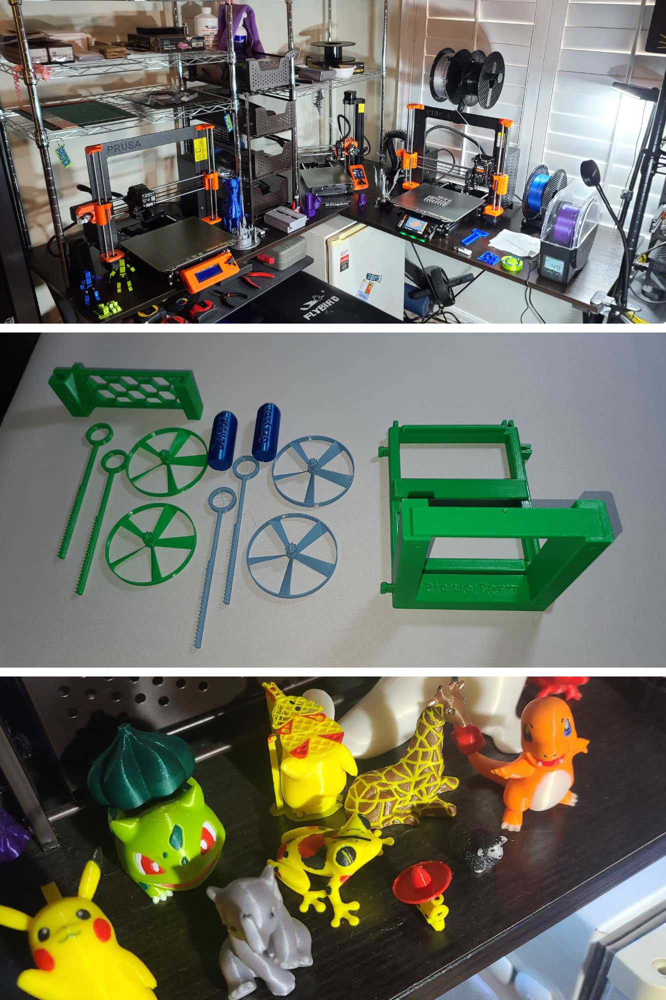
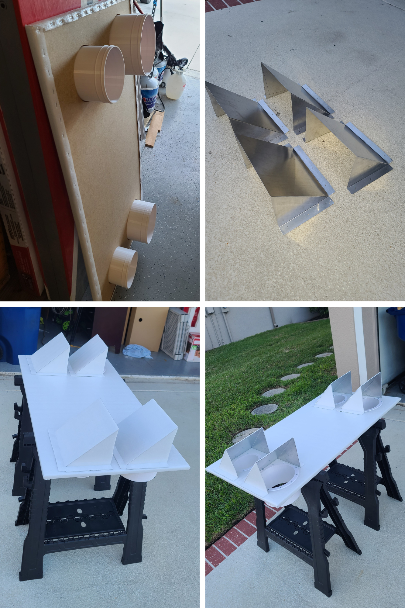
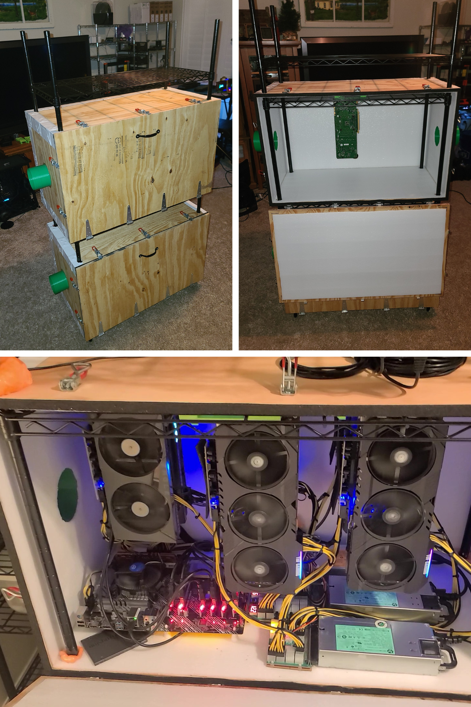
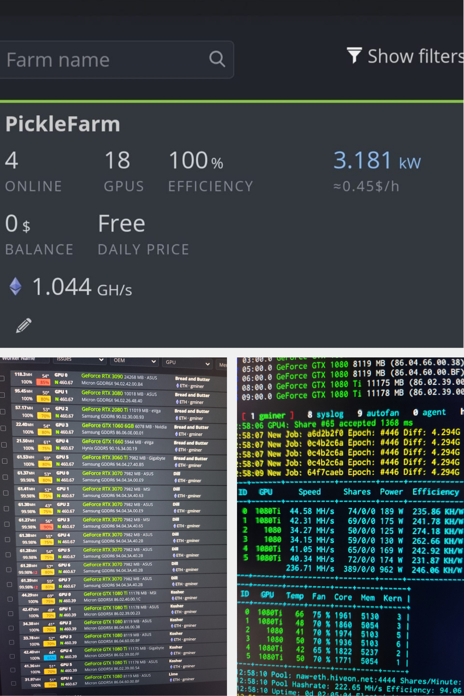

# 💡 GerkenPickleFarm, LLC

GerkenPickleFarm designs and produces 3D models and manages cryptocurrency operations.

---

## 🖨️ 3D Printing  
GerkenPickleFarm operates three 3D printers, designing and producing models in a variety of materials. We support multi-material and multi-color prints, with up to five colors per project.

---

## ⛏️ Crypto Mining  
GerkenPickleFarm develops and maintains custom cryptocurrency mining solutions, combining software optimization, hardware integration, and system monitoring. We focus on efficiency, scalability, and hands-on innovation to create reliable, high-performance mining setups.

### 🔧 Custom Cooling Solution

  
  

<b>Left image:</b> Custom-designed and hand-built window ducting vent to support cooling flanges.

<b>Right image:</b> Grow tent with custom vent cooling to manage heat.

---

### 🌀 Cooling Innovation & Optimization

  
  

<b>Left image:</b> Custom design and hand-built cooling solution upgrade. Utilizes custom 3D printed models.

<b>Right image:</b> GPU efficiency ratings and overclocking settings for optimized energy performance.

---

### 🖥️ Mining Hardware

  
  

<b>Left image:</b> Custom mining frames designed and hand-built from aluminum angle pieces.

<b>Right image:</b> Assembled plug-and-play mining rigs with and without GPUs.

